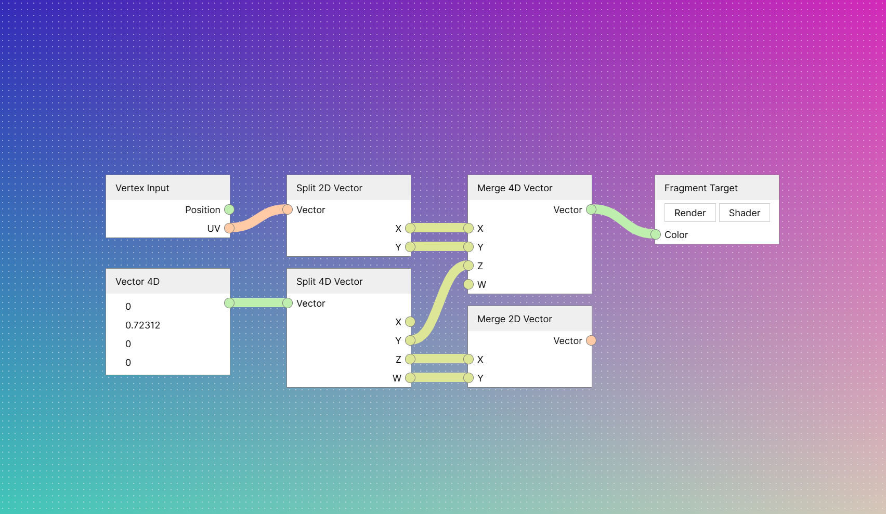

# Node system

## About this experiment
Introduce a node system with real-time capability, as well as Web Component for editing nodes. The node system will be
adapted for all kind of apps, which means it should be generalized.

## How to use
In this demo, you can right click anywhere in the node network view to open context menu. Right click in empty space to
open context menu for entire node network, right click on a node to open context menu for that node.

Node network view navigation controls:

- ~~Click and drag LMB to select multiple nodes~~.
- Click and drag MMB to pan (or pan with trackpad).
- Drag and drop socket of the same type to connect.
  - Most of the socket only accepts at most 1 input.
  - Some socket can accept more than 1 input.

## Goals
In order to consider this experiment a success, all required goals must be achieved.

### Required goals
- [ ] Editor UI works in Chromium/Firefox
- [ ] Usable in following environments: Chromium/Firefox and Deno
- [x] Dynamically add and remove sockets
- [x] Custom UI on nodes
- [ ] Grouping nodes with sockets exporting
- [ ] Framing nodes for organization
- [ ] Routing wires

### Optional goals
- [ ] Usable in following environments: Node and Bun
- [ ] Programmatically edit the node network

## Notes
### Editing node programmatically
When inserting new node in the network, the algorithm should be able to push the nodes to left/right to make some empty
space. When removing existing node, the algorithm should also push the nodes to reclaim empty space.